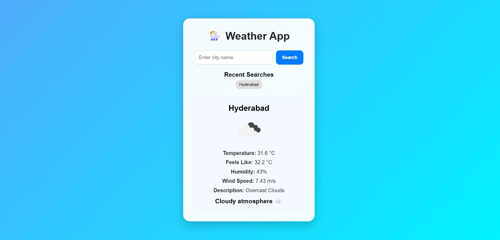
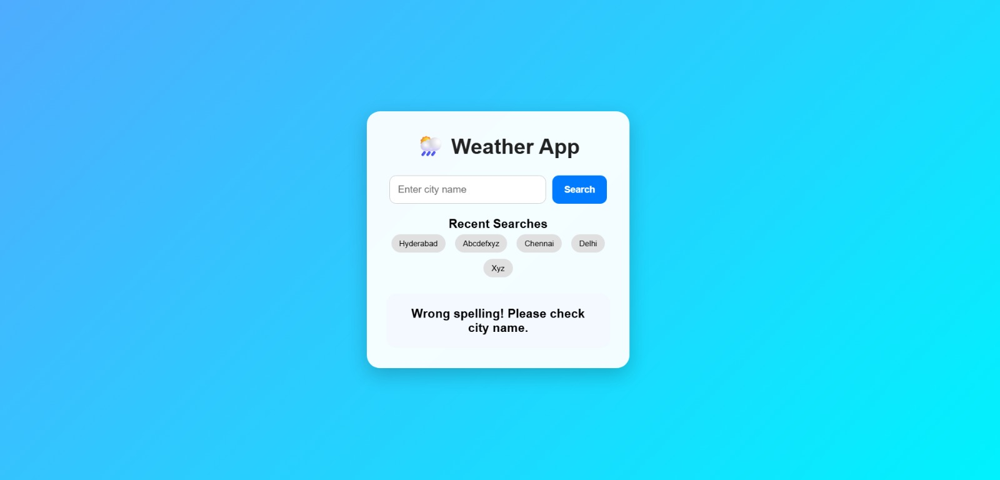
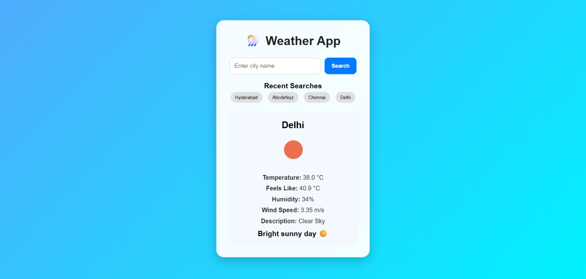

# 🌦️ Weather App


A modern weather web application built using **FastAPI**, **HTML**, **CSS**, and the **OpenWeatherMap API**.

This application allows users to search weather information for any city and displays real-time weather details through a clean, responsive, and user-friendly interface.

---

# 🚀 Live Demo

🔗 [Weather App Live](https://weather-app-qa0a.onrender.com)

🔗 [GitHub Repository](https://github.com/A-HarshavardhanReddy2006/weather-app)

---

# ✨ Features

* 🌍 Search weather by city name
* 🌡️ Real-time temperature information
* 🤗 Feels-like temperature
* 💧 Humidity details
* 🌬️ Wind speed information
* ☁️ Weather description
* 🌤️ Weather mood suggestion
* 🕒 Recent search history (last 5 searches)
* ❌ Invalid city name error handling
* 📱 Responsive user interface
* 🔐 Secure API key management using environment variables

---

# 🔄 Application Flow

```
User enters city name
          ↓
FastAPI receives request
          ↓
Request sent to OpenWeatherMap API
          ↓
Weather data processed
          ↓
Jinja2 renders dynamic webpage
          ↓
Weather information displayed to user
```

---

# 🛠️ Technologies Used

## Backend

* Python
* FastAPI
* Requests Library
* Python-dotenv

## Frontend

* HTML5
* CSS3
* Jinja2 Templates

## API

* OpenWeatherMap API

## Deployment

* Render

---

# 📸 Screenshots

## 🏠 Home Page


---

## 🌤️ Weather Result



---

## ❌ Invalid City Name



---

## 🕒 Recent Search History



---

# 📂 Project Structure

```text
weather-app/
│
├── screenshots/
│   ├── home.jpeg
│   ├── weather.jpeg
│   ├── invalidCityname.jpeg
│   └── history.jpeg
│
├── static/
│   └── style.css
│
├── templates/
│   └── index.html
│
├── main.py
├── requirements.txt
├── README.md
├── .gitignore

```

---

# ⚙️ Installation and Setup

## Clone Repository

```bash
git clone https://github.com/A-HarshavardhanReddy2006/weather-app.git
```

## Navigate to Project

```bash
cd weather-app
```

## Create Virtual Environment

```bash
python -m venv venv
```

## Activate Environment

### Windows

```bash
venv\Scripts\activate
```

## Install Dependencies

```bash
pip install -r requirements.txt
```

## Configure Environment Variables

Create a `.env` file:

```env
API_KEY=YOUR_OPENWEATHER_API_KEY
```

## Run Application

```bash
uvicorn main:app --reload
```

Open:

```
http://127.0.0.1:8000
```

---

# 🔐 Security

* API keys are stored using environment variables
* `.env` file is excluded using `.gitignore`
* Sensitive information is not stored in source code

---

# 📚 What I Learned

* Building web applications using FastAPI
* Creating API integrations
* Handling HTTP requests
* Jinja2 template rendering
* Environment variable management
* Secure credential handling
* Git and GitHub workflow
* Responsive frontend development
* Cloud deployment using Render

---

# 🚀 Future Improvements

* 🔑 User authentication system
* 🗄️ Database integration for weather history
* 🌦️ 5-day weather forecast
* 📍 Location-based weather detection
* 📊 Weather analytics and charts
* 🐳 Docker containerization
* ⚡ CI/CD deployment pipeline
* 🎨 Advanced UI improvements

---

# 👨‍💻 Author

**Harshavardhan Reddy Appi Reddigari**

🎓 B.Tech Computer Science Engineering Student

### GitHub

[GitHub Profile](https://github.com/A-HarshavardhanReddy2006)

### LinkedIn

[LinkedIn Profile](https://www.linkedin.com/in/harshavardhan-reddy-appi-reddigari-64b305307/)

⭐ If you find this project useful, consider giving it a star!
